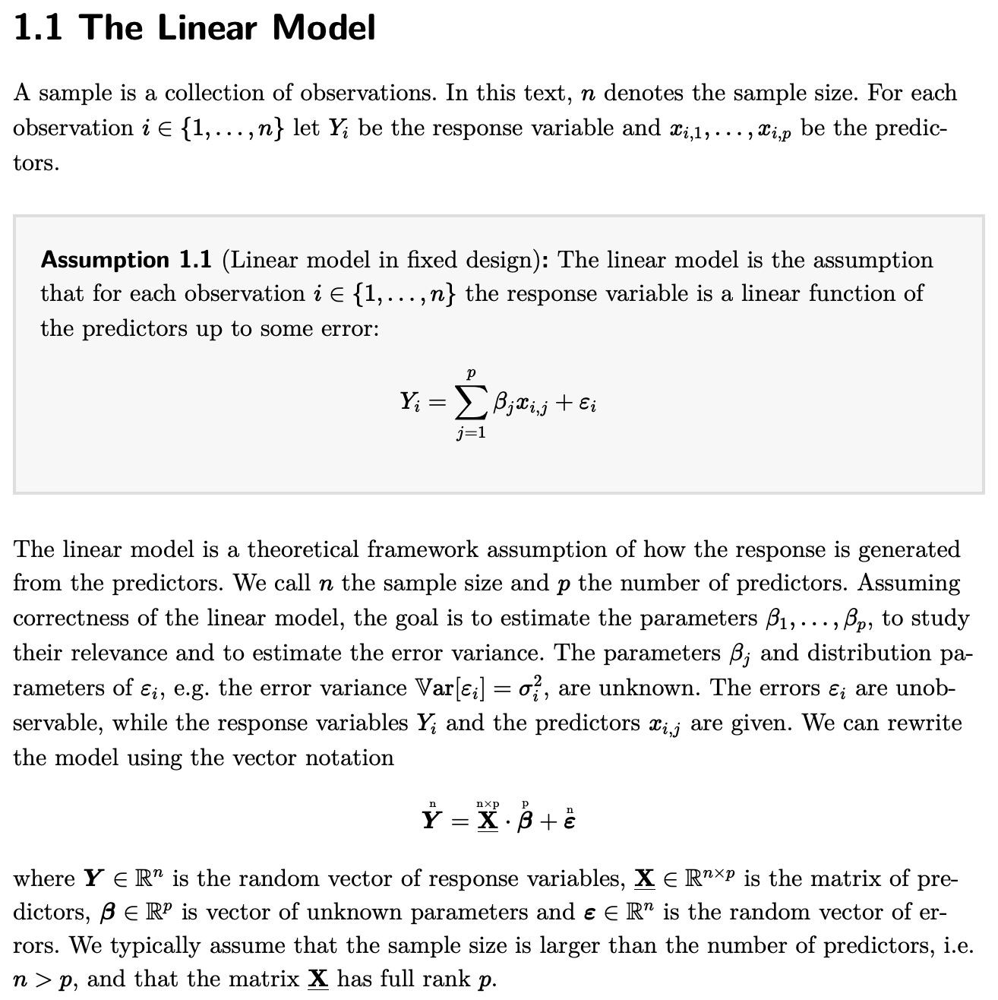

I am an ETH Zurich CSE/Stats student currently working on **MarkTeX**:
- a Hugo-based static site generator that converts LaTeX to HTML
- enabling *true* mathematical typesetting on the web
- see [an example](https://ansamuel.com/notes/introprob/04/)
- and another example:

---

